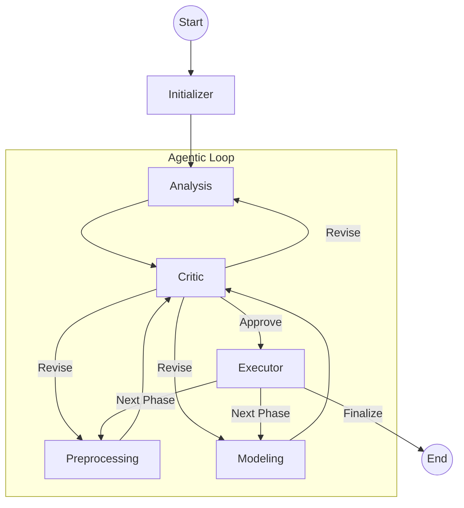

# Workflow & Orchestration

Autonoma uses **LangGraph** to define the execution flow. The workflow is a directed graph where nodes represent agents or execution steps, and edges represent the transitions between them.

## 🗺️ Graph Structure

The graph is defined in `src/autonoma/graph/workflow.py`.

### Nodes
- **Initializer**: Prepares the environment and loads the initial dataset info.
- **Analysis**: Conducts exploratory data analysis.
- **Preprocessing**: Cleans data and prepares features.
- **Modeling**: Trains and tunes the machine learning model.
- **Critic**: Evaluates the proposed actions of the other agents.
- **Executor**: Runs the actual tool calls on the data.

### Edges & Routing
Transitions are controlled by routing functions:
- `route_from_critic`: Decides whether to proceed to `Executor` (on "Approve") or back to the agent (on "Revise").
- `route_after_execution`: Determines the next phase after a set of tools has been run (e.g., Analysis -> Preprocessing -> Modeling).

## 📊 Workflow Diagram (Conceptual)

## 🔁 Iteration Limits
To prevent infinite loops, the system has built-in limits:
- `MAX_CRITIC_ITERATIONS`: The number of times a Critic can ask an agent to revise its plan (default: 3).
- `MAX_MODELING_ITERATIONS`: The number of times the modeling phase can be repeated to find the best model (default: 3).

---

[Next: State Management](./state_management.md)
